**Backend / web engineer in Tokyo. I build languages, APIs and tools.** 
在东京读研的后端工程师，造语言、写 API、做工具。

[ORCID](https://orcid.org/0009-0005-2312-1336) · [Sprig docs](https://colinhouse.github.io/Sprig/)

## About · 关于我

- **Master's student at The University of Tokyo** (EEIS), graduating in 2028. 
  东京大学 电气系工学专攻 硕士在读，28 卒。
- **Physics background, now speech.** I study the internal representations of self-supervised speech models. 
  物理本科，现在研究语音自监督学习模型的内部表征。
- **Backend services** with FastAPI and Spring Boot, plus a programming language of my own. 
  平时用 FastAPI / Spring Boot 写后端，顺便自己造了一门语言。
- **Working languages:** 中文 · English · 日本語

## Projects · 代表项目

  
  

## Open source · 开源贡献

Pull requests merged into other people's projects. 
合并进上游项目的 PR。

<!-- upstream:start -->
| Project | Merged | Latest pull request |
|:--|:-:|:--|
| [**langgenius/dify**](https://github.com/langgenius/dify)&nbsp;★&nbsp;158k | [3](https://github.com/langgenius/dify/pulls?q=is%3Apr+is%3Amerged+author%3AColinHouse) | [refactor(files): dep-inject query params with @model_validate](https://github.com/langgenius/dify/pull/42314) |
| [**sqlfluff/sqlfluff**](https://github.com/sqlfluff/sqlfluff)&nbsp;★&nbsp;9.9k | [2](https://github.com/sqlfluff/sqlfluff/pulls?q=is%3Apr+is%3Amerged+author%3AColinHouse) | [Add an RF06 case for a case-sensitive quoted alias in Oracle](https://github.com/sqlfluff/sqlfluff/pull/8655) |
| [**MaaXYZ/MaaFramework**](https://github.com/MaaXYZ/MaaFramework)&nbsp;★&nbsp;5.0k | [1](https://github.com/MaaXYZ/MaaFramework/pulls?q=is%3Apr+is%3Amerged+author%3AColinHouse) | [fix(python): 修复绑定初始化的线程竞态导致并发连接失败 (#629)](https://github.com/MaaXYZ/MaaFramework/pull/1490) |
| [**AUTO-MAS-Project/AUTO-MAS**](https://github.com/AUTO-MAS-Project/AUTO-MAS)&nbsp;★&nbsp;711 | [3](https://github.com/AUTO-MAS-Project/AUTO-MAS/pulls?q=is%3Apr+is%3Amerged+author%3AColinHouse) | [fix(bettergi): 单个 JS 脚本的 manifest.json 坏了不再让整个脚本列表拿不到](https://github.com/AUTO-MAS-Project/AUTO-MAS/pull/783) |
<!-- upstream:end -->

## Activity · 动态

## Toolbox · 技术栈

<table>
  <tr><td><b>Languages</b></td><td><kbd>Python</kbd> <kbd>Java</kbd> <kbd>TypeScript</kbd></td></tr>
  <tr><td><b>Backend</b></td><td><kbd>FastAPI</kbd> <kbd>Spring Boot</kbd> <kbd>MyBatis-Plus</kbd> <kbd>MySQL</kbd></td></tr>
  <tr><td><b>Frontend</b></td><td><kbd>Vue 3</kbd> <kbd>PWA</kbd></td></tr>
  <tr><td><b>Research</b></td><td><kbd>PyTorch</kbd></td></tr>
  <tr><td><b>Tooling</b></td><td><kbd>ANTLR4</kbd> <kbd>Docker</kbd> <kbd>GitHub Actions</kbd> <kbd>Linux</kbd> <kbd>Git</kbd></td></tr>
</table>

Fig. 1 is a stylized mel spectrogram of the word “syrinx”. The figures on this page are SVGs drawn by <a href="https://github.com/ColinHouse/ColinHouse/blob/main/scripts/build.py">one small script</a> in this repo.

Thanks for stopping by · 感谢来访

